# How to authorize Node.js API with Azure AD

## Introduction
This is a web app sample with Node.js, and it demonstrates how to authorize a Node.js API with Azure AD.  
It uses the `adal-node` library to authorize with Azure AD.  
In this sample, you can test the authorized Node.js API with Azure AD.  

## Sample prerequisites
To open and run this sample, ensure that the following requisites have been met: 

- Node.js 6.6.0 or above.
- NPM is installed (it has to be installed before you installed Node.js).
- An active Azure subscription 
- You have the permission to manage Azure Active Directory on your subscription.

## Building the sample  
**Restore the libraries**  
- Open the Command Prompt window and navigate to the sample location folder. In this case, the sample location is D:\Sample\JSAzureADAuthWithNodeJS.  
  
  

- Install the folling Node.js libraries:

    - `npm install express`
    - `npm install cookie-parser`
    - `npm install cookie-session`
    - `npm install crypto`
    - `npm install adal-node`

      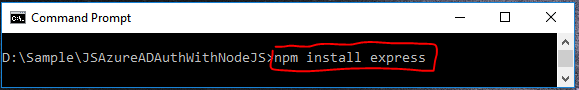

**Configuration App in Azure**

- Navigate to the [Azure Portal](https://portal.azure.com) and login.
- On the left hand side panel, find **Azure Active Directory** and click to open it. Alternatively, you can search for **Azure Active Directory** under **more services**.
  
  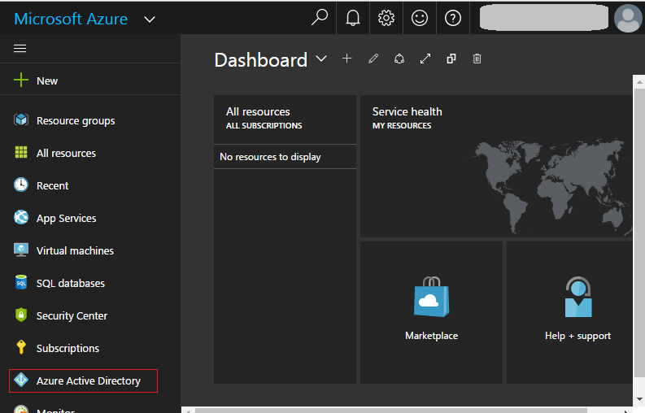

- Click the **App registrations** in Azure Active Directory management panel.
  
  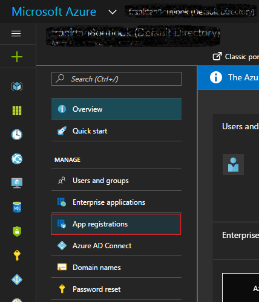

- Click the **Add** button.
  
  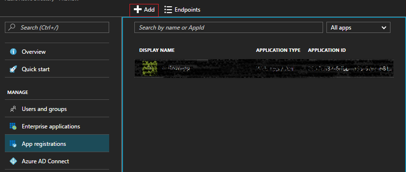

- Fill in the **Name** and **Sign-on URL**, and choose the Application Type as **Web app / API**. Finally, click the **Create** button.
  
  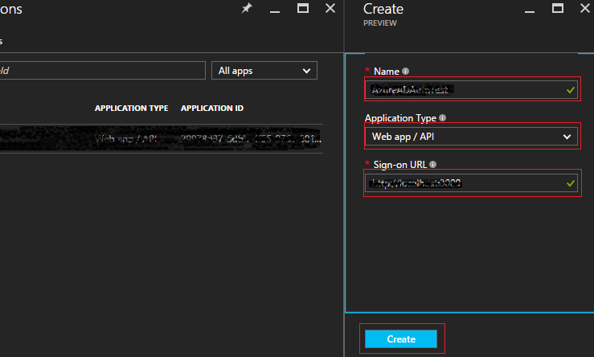

- Once your application has been created and is visible in the application list, click to open it.
  
  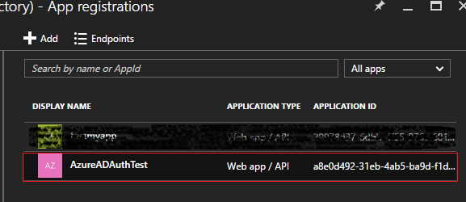

- You should be presented with the following blade. Click on **Settings**.
  
  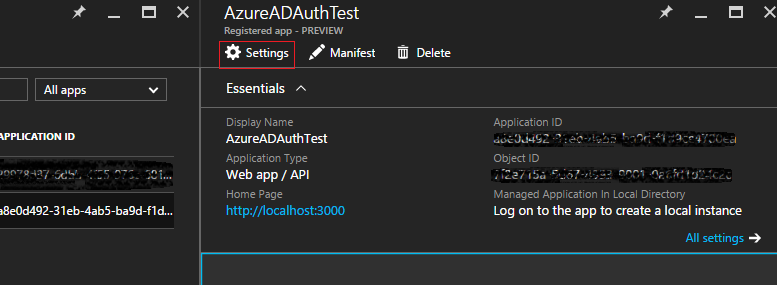

- Click on the **Reply URLs**, then change the URI address to [http://localhost:3000/getAToken](http://localhost:3000/getAToken). Finally, click on the **Save** button.
  
  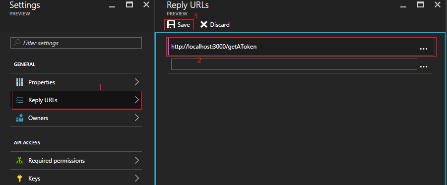

- Click on **Keys**, then type a string in field **DESCRIPTION**, Choose EXPIRES as **Never expires**, type a string to the **VALUE** field, then click **Save** button.
  
  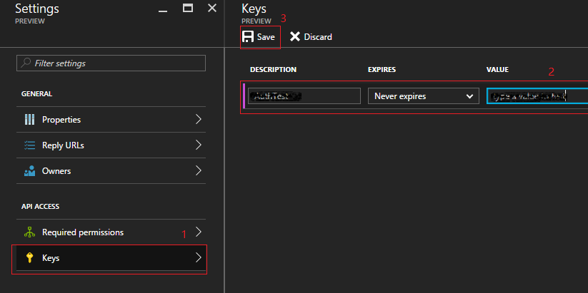

- IMPORTANT: After you have successfully created the key, copy its value. This is because it's only shown once and once you leave the blade you won’t be able to retrieve again.
  If you fail to copy it, you'll need to create a new key.

  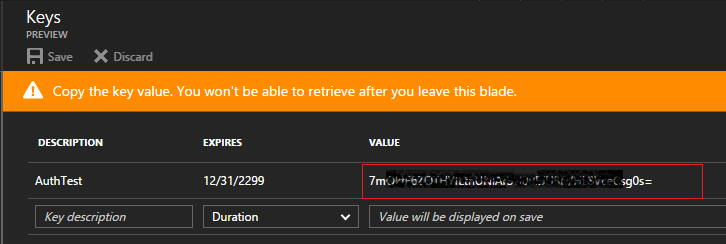

**Configuration parameters**  
With the Azure AD application in place we can now update to sample code to run the application. 
Open the `server.js` file and configure the following fields.

``` javascript
var authObj = require("./Auth.js").Create({
    tenant:"<your tenant name, e.g xxxx.onmicrosoft.com>",
    clientId:"<you appliction id in Azure AD>",
    secret:"<app key you copyied>",
    redirectUri:"http://localhost:3000/getAToken"
});

```

- **Tenant** This information can be found in the Azure Portal dashboard.
  
  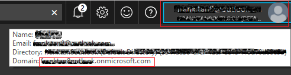

- **clientID** This information can be found in the portal under `Azure Active Directory -> App registrations -> <your application>`. Copy the **Application ID**.
  
  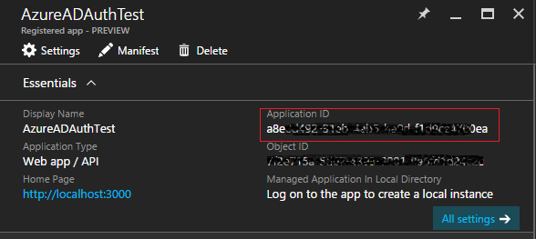

- **secret** This is the Azure Application key we created at the previous section.
  
  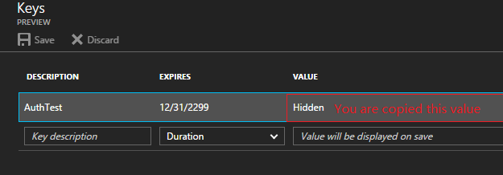

## Running the sample

- Open the Command Prompt window and navigate to the directory that the sample app code resides. For this example, the sample's location is D:\Sample\JSAzureADAuthWithNodeJS.
  
  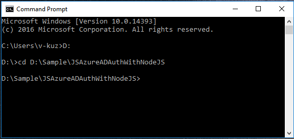

- Type command: **node server.js** to start the web server.
  
  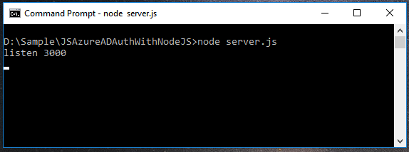

- Open the browser, and navigate to [http://localhost:3000](http://localhost:3000). Then click on the **Login** link.
  
  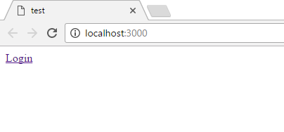

- Type your Azure credentials.
  
  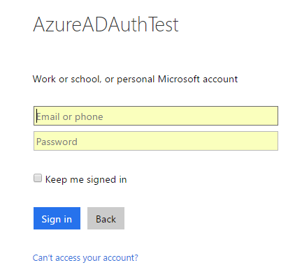

  > NOTE: this account must exist in your Azure AD.

- If the login is successful, you should be presented with the following page which contains all the authorization information.
  
  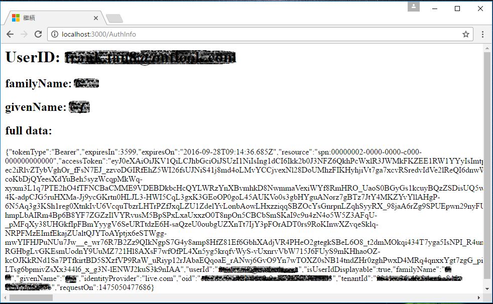

## Using the code

**Auth.js**
``` javascript
'use strict';

var crypto = require('crypto');
var AuthenticationContext = require('adal-node').AuthenticationContext;

module.exports = {
    Create:function(params){
        var authObj = {
            tenant:params.tenant,
            clientId:params.clientId,
            secret:params.secret,
            redirectUri:params.redirectUri
        };

        authObj.authorityHostUrl = "https://login.windows.net";
        authObj.authorityUrl = authObj.authorityHostUrl + "/" + authObj.tenant;
        authObj.resource = "00000002-0000-0000-c000-000000000000";
        authObj.templateAuthzUrl = 'https://login.windows.net/' + authObj.tenant + '/oauth2/authorize?response_type=code&client_id=<client_id>&redirect_uri=<redirect_uri>&state=<state>&resource=<resource>';

        authObj.loginIfNotAuth = function(req,res,action){
            if(isAuthored(req))
            {
                if(isExpire(req))
                {
                    authObj.refreshToken(req,res,action);
                }
                else{
                    action();
                }
            }
            else
            {
                authWithAzureAD(res);
            }
        };

        authObj.receiveToken = function(req,res,action){
            if (req.cookies.authstate !== req.query.state) {
                res.send('error: state does not match');
                return;
            }

            var authenticationContext = new AuthenticationContext(authObj.authorityUrl);
            authenticationContext.acquireTokenWithAuthorizationCode(req.query.code, authObj.redirectUri, authObj.resource, authObj.clientId, authObj.secret, function(err, response) {
                var message = '';
                if (err) {
                    message = 'error: ' + err.message;
                    res.send(message);
                    return;
                }
                response.requestOn = Date.now();
                //set token to session
                req.session.authInfo = response;
                //do the action
                if(action){
                    action();
                }
            });
        };

        authObj.refreshToken = function(req,res,action) {
            var authenticationContext = new AuthenticationContext(authObj.authorityUrl);
            authenticationContext.acquireTokenWithRefreshToken(req.session.authInfo.refreshToken, authObj.clientId, authObj.secret, authObj.resource, function(refreshErr, refreshResponse) {
                if (refreshErr) {
                    var message = 'refreshError: ' + refreshErr.message;
                    res.send(message); 
                    return;
                }
                refreshResponse.requestOn = Date.now();
                //set token to session
                req.session.authInfo = refreshResponse;
                //do the action
                if(action){
                    action();
                }
            }); 
        };

        function authWithAzureAD(res){
            crypto.randomBytes(48, function(ex, buf) {
                var token = buf.toString('base64').replace(/\//g,'_').replace(/\+/g,'-');

                res.cookie('authstate', token);
                var authorizationUrl = createAuthorizationUrl(token);

                res.redirect(authorizationUrl);
            });
        }

        function isAuthored(req){
            return req.session.authInfo;
        }

        function isExpire(req){
            var now = Date.now();
            var requestOn = req.session.authInfo.requestOn;
            var expiresIn = req.session.authInfo.expiresIn * 1000;
            return requestOn + expiresIn >= Date.now();
        }

        function createAuthorizationUrl(state) {
            var authorizationUrl = authObj.templateAuthzUrl.replace('<client_id>', authObj.clientId)
                .replace('<redirect_uri>',authObj.redirectUri)
                .replace('<state>', state)
                .replace('<resource>', authObj.resource);
            return authorizationUrl;
        }

        return authObj;
    }
};

```

**Server.js**

``` javascript
'use strict';

var express = require('express');
var cookieParser = require('cookie-parser');
var cookieSession = require('cookie-session');

var authObj = require("./Auth.js").Create({
    tenant:"<your tenant name, e.g xxxx.onmicrosoft.com>",
    clientId:"<you appliction id in Azure AD>",
    secret:"<app key you copyied>",
    redirectUri:"http://localhost:3000/getAToken"
});

var app = express();
app.use(cookieParser('a deep secret'));
app.use(cookieSession({name: 'session',keys: [""]}));

app.get('/', function(req, res) {
    res.end('\
        <head>\
        <title>test</title>\
        </head>\
        <body>\
        <a href="./auth">Login</a>\
        </body>\
    ');
});

app.get('/auth', function(req, res) {
    authObj.loginIfNotAuth(req,res,function(){
        res.send("authed");
    });
});

app.get('/getAToken', function(req, res) {
    authObj.receiveToken(req,res,function(){
        res.redirect('/AuthInfo');
    });
});

app.get('/AuthInfo', function(req, res) {
    var sessionValue = req.session.authInfo;
    var authString = JSON.stringify(sessionValue);
    var userID = sessionValue.userId;
    var familyName = sessionValue.familyName;
    var givenName = sessionValue.givenName;

    res.end(`\
        <h1>UserID: ${userID}</h1>
        <h2>familyName: ${familyName}</h2>
        <h2>givenName: ${givenName}</h2>
        <h2>full data:</h2>
        <p>${authString}</p>
    `);
});

app.listen(3000);
console.log("listen 3000");
```

## More information
- Windows Azure Active Directory Authentication Library (ADAL) for Node.js
[https://github.com/AzureAD/azure-activedirectory-library-for-nodejs](https://github.com/AzureAD/azure-activedirectory-library-for-nodejs)